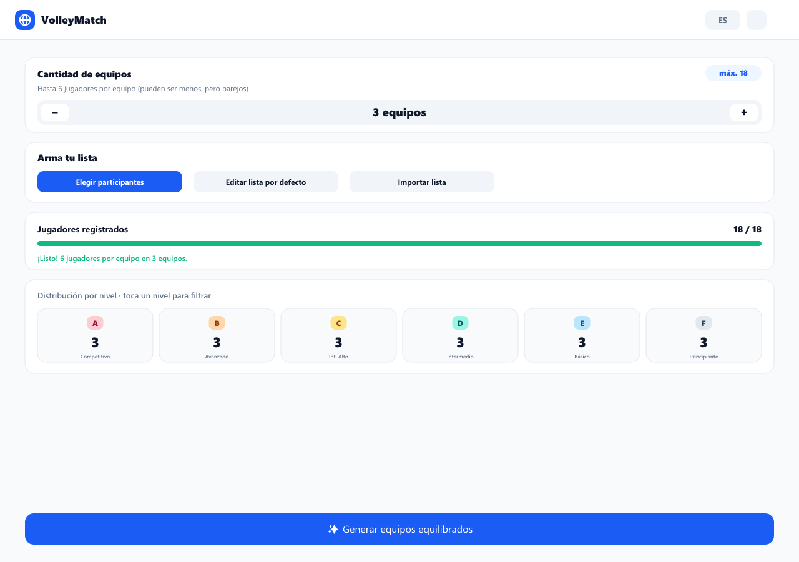
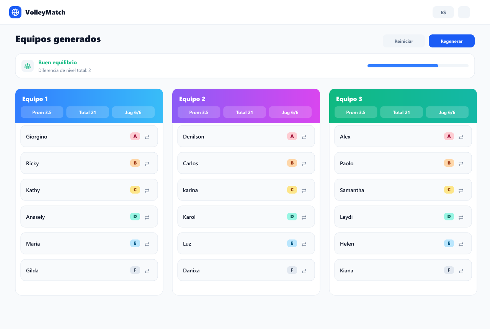
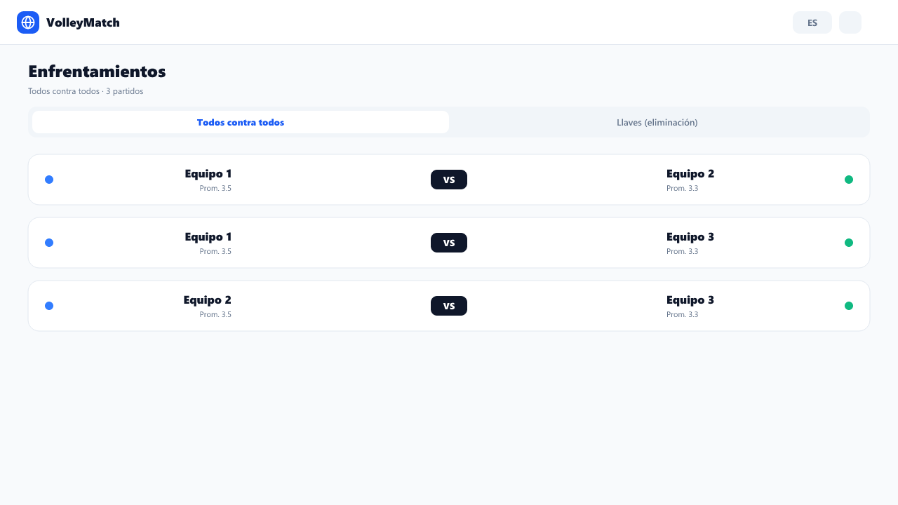
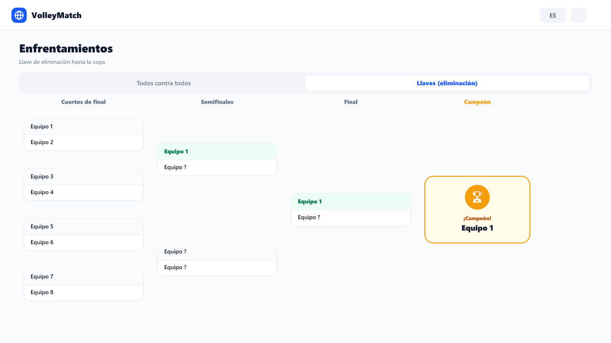

<div align="center">

# 🏐 Volley Match

**Build balanced volleyball teams by level, get swap suggestions, and run tournaments with brackets to the cup.**

Free · Bilingual (ES/EN) · No sign-up · Works offline

[🇪🇸 Español](README.md) · [🌐 Landing](public/landing.html) · [📣 Social media kit](docs/marketing/PROMPTS.md)


</div>

---

## ✨ Features

### 🧩 Build the list
- **Welcome landing screen** that explains the app and leads to setup.
- **Choose participants** from a pool via checkboxes (warns if short of capacity).
- **Edit default list** (CRUD): add, edit, delete, clear (with confirmation) and restore factory list.
- **Import a list** by pasting text (e.g. a WhatsApp group): names and levels are auto-detected.
- **Add a player** manually with validation.
- **Add to default list** the current players (merge without duplicating or deleting).
- **Level distribution** counter cards that also **filter** the list when tapped.

### ⚖️ Balanced teams
- **2 to 16 teams**, **max 6 per team** (6 vs 6). Allows even teams with fewer (4v4, 5v5…). Great for tournaments.
- **Balancing algorithm**: groups by level, shuffles, and distributes in a **serpentine** pattern (not random).
- **Per-team metrics**: average level, total, and count.
- **Balance indicator** and **automatic swap suggestions** (prioritizes same-level candidates).
- **Reorganize teams** with a per-player **swap button** → modal to **swap** or **move** to a team with space.
- **Rename teams** (inline) and **reset names**.

### 🏆 Tournament
- **Round robin** generated automatically.
- **Knockout bracket** with level-based seeding, **automatic byes**, and advancement to the **champion 🏆**.

### 🎨 Experience
- **Letter levels (A–F)** with per-level color and the name as a tooltip.
- **Bilingual (ES/EN)** with a header switch (remembered).
- **Light / dark mode**.
- **Responsive** (mobile-first; 2-column list on tablet/desktop).
- **Auto-persistence** in LocalStorage (players, teams, config, default roster, language and theme).

## 🖼️ Screenshots

| Setup | Teams |
| --- | --- |
|  |  |

| Matches | Bracket (tournament) |
| --- | --- |
|  |  |

> The current images are **on-brand mockups** for reference. For real product
> screenshots, follow the [capture guide](docs/screenshots/README.md) (~2 min).

## 🧱 Stack

React 18 · TypeScript (strict) · Vite · Tailwind CSS · Zustand · React Hook Form · Lucide React.

## 🚀 Run it

```bash
npm install
npm run dev
```

Open the URL Vite prints (default `http://localhost:5173`).
The static **marketing landing** is at `http://localhost:5173/landing.html`.

### Other scripts

```bash
npm run build     # Type-check + production build
npm run preview   # Serve the production build locally
npm run lint      # Type check (tsc --noEmit)
```

## 🧠 Logic (utils/)

1. `groupPlayersByLevel()` — group by level (higher rank first).
2. `shufflePlayers()` — Fisher–Yates shuffle.
3. `generateTeams()` — serpentine distribution to balance total level.
4. `calculateTeamMetrics()` — average, total and count per team.
5. `getBalanceSuggestions()` — proposes swaps that reduce the gap (same level first).
6. `generateMatches()` — round robin schedule.
7. `buildBracket()` / `setBracketWinner()` — knockout bracket (seeding + byes) and advancement to the cup.
8. `parseRoster()` — parses pasted text (WhatsApp) into names + levels.

## 🏷️ Levels

> The level is shown as a **letter** (A = highest, F = lowest). The full name appears as a tooltip.

| Letter | Description       |
| ------ | ----------------- |
| A      | Competitive       |
| B      | Advanced          |
| C      | Upper Intermediate|
| D      | Intermediate      |
| E      | Basic             |
| F      | Beginner          |

## 🔄 Default list (pool) vs. participants

Two **independent** lists:

- **Default list (pool)**: your master roster, editable in *Edit default list* and persisted.
  - If never customized, a factory list is used.
  - If emptied (with confirmation), it stays empty on refresh.
  - *Add to default list* merges new players without deleting anyone.
- **Participants** (*Registered players*): who plays today (max `teams × 6`, even teams), chosen from the pool, imported, or added manually.

## 🧭 Recommended flow

1. From the **landing**, tap **Get started**.
2. Pick the **number of teams** and **build your list** (*Choose participants* / *Import* / *Add*).
3. Adjust levels and review the **level distribution**.
4. **Generate balanced teams** and reorganize with the **swap button** (swap/move).
5. Go to **Matches**: *Round robin* or *Knockout* until crowning the **champion 🏆**.

---

Made by [edlazdev](https://github.com/edlazdev) · [Instagram](https://www.instagram.com/_edgar.lazaro/)
