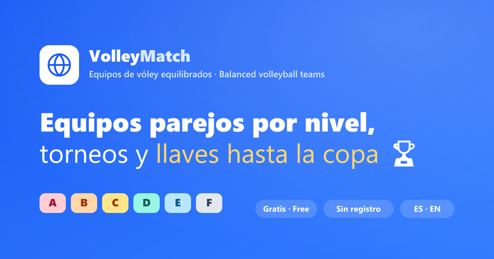

<div align="center">

# 🏐 Volley Match

**Forma equipos de vóley equilibrados por nivel, recibe sugerencias de cambio y arma torneos con llaves hasta la copa.**

Gratis · Bilingüe (ES/EN) · Sin registro · Funciona sin conexión

[🇬🇧 English](README.en.md) · [🌐 Landing](public/landing.html) · [📣 Material para redes](docs/marketing/PROMPTS.md)



</div>

---

## ✨ Características

### 🧩 Armar la lista
- **Pantalla de bienvenida (landing)** que explica la app y lleva a la configuración.
- **Elegir participantes** desde un pozo con checkboxes (avisa si faltan para el cupo).
- **Editar lista por defecto** (CRUD): agregar, editar, eliminar, vaciar (con confirmación) y restaurar de fábrica.
- **Importar lista** pegando texto (p. ej. del grupo de WhatsApp): detecta nombres y niveles automáticamente.
- **Agregar jugador** a mano con validación.
- **Añadir a lista por defecto** los jugadores actuales (fusión sin duplicar ni borrar).
- **Distribución por nivel** con tarjetas‑contador que además **filtran** la lista al tocarlas.

### ⚖️ Equipos equilibrados
- **2 a 16 equipos**, **máximo 6 por equipo** (6 vs 6). Permite equipos parejos con menos (4v4, 5v5…). Ideal para torneos.
- **Algoritmo de balance**: agrupa por nivel, mezcla y reparte en **serpentina** para equipos parejos (no al azar).
- **Métricas por equipo**: nivel promedio, total y conteo.
- **Indicador de equilibrio** y **sugerencias automáticas de intercambio** (prioriza candidatos del mismo nivel).
- **Reorganizar equipos** con un **botón de cambio** por jugador → modal para **intercambiar** o **mover** a un equipo con cupo.
- **Renombrar equipos** (edición en línea) y **reiniciar nombres**.

### 🏆 Torneo
- **Todos contra todos** (round robin) generado automáticamente.
- **Llaves de eliminación** con siembra por nivel, **byes automáticos** y avance hasta el **campeón 🏆**.

### 🎨 Experiencia
- **Niveles por letra (A–F)** con color por nivel y nombre en tooltip.
- **Bilingüe (ES/EN)** con selector en el header (se recuerda).
- **Modo claro / oscuro**.
- **Responsive** (mobile‑first; lista en 2 columnas en tablet/desktop).
- **Persistencia automática** en LocalStorage (jugadores, equipos, configuración, lista por defecto, idioma y tema).

## 🖼️ Capturas

Las capturas viven en [`docs/screenshots/`](docs/screenshots/) — sigue la
[guía de capturas](docs/screenshots/README.md) para generarlas (toma ~2 min).

| Configuración | Equipos | Llaves |
| --- | --- | --- |
| `docs/screenshots/config.png` | `docs/screenshots/teams.png` | `docs/screenshots/bracket.png` |

## 🧱 Stack

React 18 · TypeScript (estricto) · Vite · Tailwind CSS · Zustand · React Hook Form · Lucide React.

## 🚀 Cómo ejecutar

```bash
npm install
npm run dev
```

Abre la URL que muestra Vite (por defecto `http://localhost:5173`).
La **landing estática** de marketing está en `http://localhost:5173/landing.html`.

### Otros scripts

```bash
npm run build     # Compila TypeScript y genera el build de producción
npm run preview   # Sirve el build de producción localmente
npm run lint      # Chequeo de tipos (tsc --noEmit)
```

## 🗂️ Arquitectura

```text
src/
├── components/      # Componentes (UI + dominio)
│   └── ui/          # Button, Card, Input, Select, Modal, Stepper…
├── pages/           # LandingPage, ConfigPage, TeamsPage, MatchesPage
├── layouts/         # AppLayout (header, navegación, footer)
├── i18n/            # Internacionalización (es/en): provider, hook y textos
├── hooks/           # useTheme, useTeamData
├── store/           # Store Zustand + persistencia
├── services/        # Adaptador de LocalStorage
├── utils/           # Algoritmos de balance, llaves, matches, parseo
├── types/           # Tipos TypeScript del dominio
├── data/            # Catálogo de niveles, roster de fábrica, constantes
└── App.tsx
public/
├── landing.html     # Landing estática de marketing (bilingüe)
└── og-image.(svg|png) # Imagen para compartir en redes
docs/
├── marketing/       # Prompts de IA y copys para redes
└── screenshots/     # Capturas (con guía)
```

## 🧠 Lógica (utils/)

1. `groupPlayersByLevel()` — agrupa por nivel (menor letra = mayor jerarquía primero).
2. `shufflePlayers()` — mezcla aleatoria (Fisher–Yates).
3. `generateTeams()` — reparte en serpentina para equilibrar el nivel total.
4. `calculateTeamMetrics()` — promedio, total y conteo por equipo.
5. `getBalanceSuggestions()` — propone intercambios que reducen la diferencia (prioriza mismo nivel).
6. `generateMatches()` — round robin de enfrentamientos.
7. `buildBracket()` / `setBracketWinner()` — llave de eliminación (siembra + byes) y avance hasta la copa.
8. `parseRoster()` — interpreta texto pegado (WhatsApp) en nombres + niveles.

## 🏷️ Niveles

> El nivel se muestra como una **letra** (A = más alto, F = más bajo). El nombre completo aparece como tooltip.

| Letra | Descripción      |
| ----- | ---------------- |
| A     | Competitivo      |
| B     | Avanzado         |
| C     | Intermedio Alto  |
| D     | Intermedio       |
| E     | Básico           |
| F     | Principiante     |

## 🔄 Lista por defecto (pozo) vs. participantes

Son **dos listas independientes**:

- **Lista por defecto (pozo)**: tu plantel maestro, editable en *Editar lista por defecto* y persistido.
  - Si nunca la personalizas, se usa una lista de fábrica.
  - Si la vacías (con confirmación), se respeta vacía al refrescar.
  - *Añadir a lista por defecto* fusiona jugadores nuevos sin borrar a nadie.
- **Participantes** (*Jugadores registrados*): quiénes juegan hoy (máximo `equipos × 6`, equipos parejos), elegidos del pozo, importados o agregados a mano.

## 🧭 Flujo recomendado

1. Desde la **landing**, pulsa **Comenzar**.
2. Elige la **cantidad de equipos** y **arma tu lista** (*Elegir participantes* / *Importar* / *Agregar*).
3. Ajusta niveles y revisa la **distribución por nivel**.
4. **Genera los equipos** equilibrados y reorganiza con el **botón de cambio** (intercambiar/mover).
5. Ve a **Enfrentamientos**: *Todos contra todos* o *Llaves* hasta coronar al **campeón 🏆**.

---

Hecho por [edlazdev](https://github.com/edlazdev) · [Instagram](https://www.instagram.com/_edgar.lazaro/)
